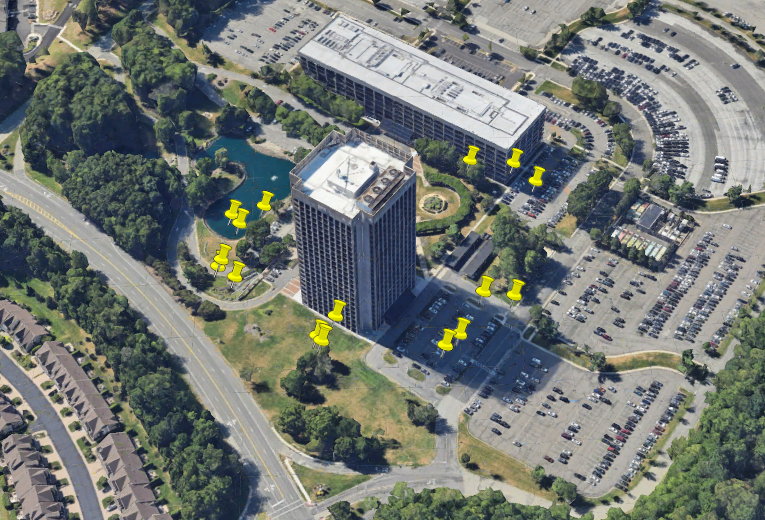
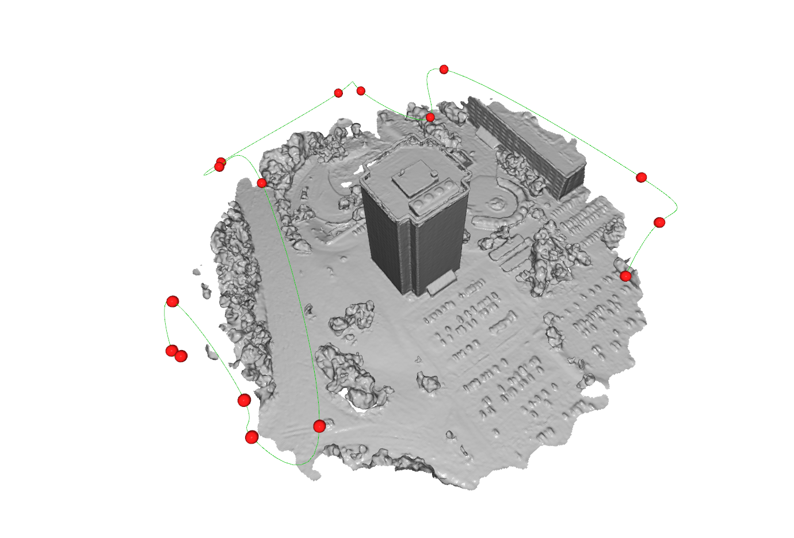

# AeroPath-NBV

## Automated Drone Flight Path Optimization & Mesh Reconstruction

AeroPath-NBV is an automated 3D computational pipeline designed to solve a critical bottleneck in aerial photogrammetry: detecting low-density gaps in Structure-from-Motion (SfM) outputs and automatically planning precision re-shooting missions.

By analyzing local geometric density, the system generates optimized, collision-free flight paths to close photogrammetric blind spots, allowing operators to fix incomplete scans before leaving the survey site.

| Flight Path Visualization with .kmz ( Opened in Google Earth Pro ) | Optimized Flight Trajectory |
|:------------:|:------------------------:|
|  |  |

---

## 🚀 Key Features

- **Adaptive Gap Analysis**
  - Detects sparse or low-density regions within dense point clouds using custom KD-Tree spatial indexing.
  - Groups neighboring artifacts into logical inspection targets using DBSCAN clustering.

- **Next-Best-View (NBV) Planning**
  - Computes optimal UAV camera viewpoints.
  - Automatically estimates gimbal pitch angles from local surface normal vectors to maximize scene coverage.

- **Poisson Surface Reconstruction**
  - Converts unstructured point clouds into watertight triangular meshes suitable for collision analysis.

- **Tensor-Accelerated Collision Avoidance**
  - Utilizes Open3D Tensor API and native `RaycastingScene` BVH acceleration structures.
  - Rejects occluded or unsafe viewpoints to improve mission safety.

- **Flight Path Optimization**
  - Solves waypoint ordering using a relaxed nearest-neighbor Traveling Salesperson heuristic with 2-opt refinement.
  - Generates smooth UAV trajectories through parametric B-Spline interpolation.

- **Geodetic WGS84 Geo-Referencing**
  - Implements Earth ellipsoid curvature calculations (`R_M` and `R_N`).
  - Converts arbitrary SfM coordinates into accurate Latitude, Longitude, and Altitude.

- **Industrial Mission Export**
  - **DJI Pilot 2 WPML** (`.kmz`)
  - **QGroundControl / MAVLink** (`.plan`)

---

## 🛠️ Tech Stack

| Category | Technologies |
|----------|--------------|
| Language | Python 3.10+ |
| 3D Geometry | Open3D (Tensor API) |
| Spatial Algorithms | KD-Tree, DBSCAN |
| Numerical Computing | NumPy, SciPy |
| Mesh Processing | Poisson Surface Reconstruction |
| Path Planning | TSP (2-opt), B-Splines |
| Data Formats | JSON, ZIP, PLY, PCD |

---

## 📂 Project Structure

```text
AeroPath-NBV/
├── main.py
├── requirements.txt
└── src/
    ├── __init__.py
    ├── analyzer.py
    ├── safety.py
    ├── optimizer.py
    ├── exporter.py
    └── visualizer.py
```

### File Overview

| File | Description |
|------|-------------|
| `main.py` | Main pipeline orchestrator |
| `analyzer.py` | Point cloud density analysis and Next-Best-View generation |
| `safety.py` | Poisson mesh reconstruction and raycasting collision filtering |
| `optimizer.py` | TSP optimization and B-Spline trajectory smoothing |
| `exporter.py` | DJI WPML (`.kmz`) and QGroundControl (`.plan`) exporters |
| `visualizer.py` | Interactive Open3D visualization pipeline |

---

# 📦 Installation

Clone the repository:

```bash
git clone https://github.com/yourusername/aeropath-nbv.git
cd aeropath-nbv
```

Create a virtual environment:

```bash
python -m venv .venv
```

Activate it.

**Windows**

```bash
.venv\Scripts\activate
```

**Linux / macOS**

```bash
source .venv/bin/activate
```

Install dependencies:

```bash
pip install -r requirements.txt
```

---

# 💻 Usage

Place your reconstructed dense point cloud inside the `data/` directory.

Supported formats include:

- `fused.ply`
- `.pcd`

Configure the reference geographic origin inside `main.py`:

```python
home_lat
home_lon
home_alt
```

Run the complete processing pipeline:

```bash
python main.py
```

---

# 📊 Processing Pipeline

The pipeline performs the following stages:

1. Dense point cloud loading
2. Spatial density analysis
3. Gap detection
4. DBSCAN clustering
5. Next-Best-View computation
6. Poisson mesh reconstruction
7. Collision verification using BVH raycasting
8. Flight path optimization
9. B-Spline trajectory smoothing
10. WGS84 geo-referencing
11. DJI WPML / MAVLink mission export
12. Interactive Open3D visualization

---

# 🖥️ Visualization

The interactive Open3D renderer provides:

- Real-time point cloud visualization
- Reconstructed Poisson meshes
- Candidate NBV viewpoints
- Collision-safe flight trajectories
- Smoothed B-Spline flight paths

Typical visualization includes:

- 🔴 Red spheres representing computed Next-Best-View camera positions.
- 🟢 Green spline trajectories representing optimized UAV flight paths.
- Reconstructed structural meshes used for collision checking.

---

# 🌍 Mission Verification

Generated mission files can be loaded directly into supported ground-control software.

Supported outputs include:

- DJI Pilot 2 WPML (`.kmz`)
- QGroundControl (`.plan`)

The exported missions preserve:

- Geographic coordinates
- Camera orientation
- Flight altitude
- Waypoint ordering
- Optimized inspection loops

allowing immediate deployment on compatible UAV platforms.